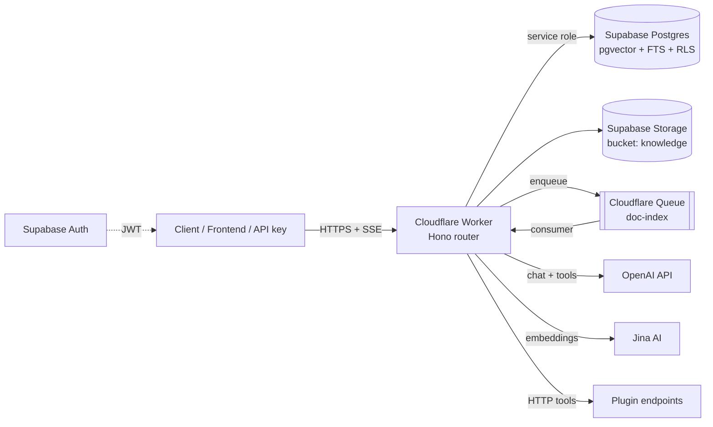

# Coze Studio — Supabase + Cloudflare Workers Port

Bản port tinh gọn của Coze Studio, chạy **hoàn toàn** trên Supabase + Cloudflare
Workers — không MySQL, không Redis, không Elasticsearch, không Milvus, không
MinIO, không NSQ, không etcd, không backend Go. Multi-tenant theo workspace,
serverless toàn phần, chi phí vận hành gần bằng 0 khi idle.

## Ánh xạ tech stack

| Coze Studio gốc | Bản port | Ghi chú |
|---|---|---|
| Go + Hertz (backend) | **Cloudflare Worker** (Hono + TypeScript) | 1 Worker duy nhất, edge-deployed |
| MySQL 8 | **Supabase Postgres** | schema + migration trong `supabase/migrations/` |
| Milvus (vector DB) | **pgvector** (HNSW, cosine) | cột `chunks.embedding vector(1024)` |
| Elasticsearch | **Postgres FTS** (`tsvector` + GIN) | hybrid search RRF trong RPC `match_chunks` |
| MinIO | **Supabase Storage** (bucket `knowledge`) | key theo prefix `workspace_id/` |
| NSQ (message queue) | **Cloudflare Queues** | fallback `ctx.waitUntil()` cho free plan |
| Redis | *(bỏ)* | Worker stateless; Postgres đủ nhanh cho quy mô này |
| etcd | *(bỏ)* | config qua `wrangler.toml` + secrets |
| Casbin / session | **Supabase Auth + RLS** | JWT verify tại edge, RLS chặn cross-tenant |
| Embedding tự host | **Jina AI** (`jina-embeddings-v3`, 1024 dim) | task-aware: `retrieval.passage` / `retrieval.query` |
| Multi-provider LLM | **OpenAI** (hoặc bất kỳ endpoint OpenAI-compatible) | `OPENAI_BASE_URL` tùy chỉnh được |

## Kiến trúc



### Multi-tenant

- Tenant = **workspace**. Mọi bảng nghiệp vụ đều có `workspace_id`.
- Người dùng đăng nhập qua **Supabase Auth**; Worker verify JWT (HS256, local,
  không round-trip) rồi check membership ở middleware `requireWorkspace`.
- **RLS bật trên tất cả các bảng** — kể cả khi client gọi thẳng PostgREST/
  Realtime cũng không đọc được dữ liệu tenant khác.
- Truy cập máy-với-máy qua **API key** (`czk_...`, hash SHA-256, scope theo
  workspace, thu hồi được).
- Token usage ghi vào `usage_events` theo tenant → billing/quota.

### RAG pipeline (knowledge)

1. Upload tài liệu (`txt/md/html/json/csv`) → Supabase Storage.
2. Queue consumer (hoặc `waitUntil` trên free plan): extract → chunk
   (paragraph-aware, overlap) → **Jina embeddings** (batch 32) → insert
   `chunks` (pgvector).
3. Truy vấn: embed câu hỏi (`retrieval.query`) → RPC `match_chunks` chạy
   **hybrid search** (HNSW cosine + FTS keyword, trộn bằng Reciprocal Rank
   Fusion) ngay trong Postgres — thay cả Milvus lẫn Elasticsearch bằng 1 câu SQL.

### Agent runtime

- System prompt (hỗ trợ biến `{{var.x}}`) + context RAG + lịch sử hội thoại.
- **OpenAI streaming** (SSE) với vòng lặp tool-calling (tối đa 5 vòng) gọi các
  HTTP plugin tool đã đăng ký.
- Mọi message, tool log, usage đều persist vào Postgres.

### Workflow engine

Engine tuần tự tối giản (1 đường chạy, có rẽ nhánh điều kiện), graph JSON
`{nodes, edges}`. Node types: `start`, `llm`, `knowledge`, `plugin`,
`condition`, `template`, `end`. Template `{{nodeId.field}}` tham chiếu kết quả
node trước. Mỗi lần chạy ghi `workflow_runs` đầy đủ input/output/node_results.

## Cấu trúc thư mục

```
supabase-port/
├── supabase/
│   ├── config.toml               # local dev (supabase start)
│   └── migrations/0001_init.sql  # toàn bộ schema + RLS + hybrid search RPC
└── worker/
    ├── wrangler.toml             # 1 Worker + 1 Queue
    ├── src/
    │   ├── index.ts              # router + queue consumer
    │   ├── indexer.ts            # pipeline embedding tài liệu
    │   ├── engine/workflow.ts    # workflow engine
    │   ├── middleware/auth.ts    # JWT + API key + tenant guard
    │   ├── lib/                  # openai, jina, retrieval, plugins, chunking
    │   ├── routes/               # REST + SSE chat
    │   └── playground.ts         # UI chat test tại /
    └── .dev.vars.example
```

## Triển khai

### 1. Supabase

```bash
# Tạo project tại https://supabase.com rồi:
cd supabase-port/supabase
supabase link --project-ref <ref>
supabase db push          # chạy migrations/0001_init.sql
```

Lấy: `SUPABASE_URL`, `service_role key`, `JWT secret` (Settings → API).

### 2. Cloudflare Worker

```bash
cd supabase-port/worker
npm install
wrangler queues create doc-index          # bỏ qua nếu dùng free plan
                                          # (xóa block queues trong wrangler.toml)
wrangler secret put SUPABASE_URL
wrangler secret put SUPABASE_SERVICE_ROLE_KEY
wrangler secret put SUPABASE_JWT_SECRET
wrangler secret put OPENAI_API_KEY
wrangler secret put JINA_API_KEY
npm run deploy
```

### 3. Dùng thử

```bash
# Đăng ký user qua Supabase Auth (client SDK hoặc REST), lấy access_token, rồi:
TOKEN=<supabase-access-token>
API=https://coze-supabase-port.<account>.workers.dev

# Tạo workspace
curl -X POST $API/v1/workspaces -H "authorization: Bearer $TOKEN" \
  -H 'content-type: application/json' -d '{"name": "My Team"}'

# Tạo agent
curl -X POST $API/v1/workspaces/$WID/agents -H "authorization: Bearer $TOKEN" \
  -H 'content-type: application/json' \
  -d '{"name": "Assistant", "prompt": "You are a helpful assistant.", "model": {"model": "gpt-4o-mini"}}'

# Chat (SSE stream)
curl -N -X POST $API/v1/workspaces/$WID/chat -H "authorization: Bearer $TOKEN" \
  -H 'content-type: application/json' \
  -d '{"agent_id": "'$AGENT'", "message": "Xin chào!"}'
```

Hoặc mở `https://<worker-url>/` — playground chat có sẵn.

## API chính

| Method | Path | Mô tả |
|---|---|---|
| GET | `/v1/me` | user + danh sách workspace |
| GET/POST | `/v1/workspaces` | list / tạo workspace |
| GET/PATCH/DELETE | `/v1/workspaces/:wid` | chi tiết tenant |
| GET/POST/DELETE | `/v1/workspaces/:wid/members[/:uid]` | thành viên |
| GET | `/v1/workspaces/:wid/usage` | token usage 30 ngày |
| CRUD | `/v1/workspaces/:wid/agents[/:id]` | agent |
| POST | `/v1/workspaces/:wid/agents/:id/publish` | snapshot release |
| POST | `/v1/workspaces/:wid/chat` | **chat SSE** (agent + RAG + tools) |
| GET/DELETE | `/v1/workspaces/:wid/conversations[/:id]` | hội thoại + messages |
| CRUD | `/v1/workspaces/:wid/datasets[/:dsid]` | knowledge base |
| POST | `/v1/workspaces/:wid/datasets/:dsid/documents` | upload + index |
| POST | `/v1/workspaces/:wid/datasets/:dsid/search` | test hybrid retrieval |
| CRUD | `/v1/workspaces/:wid/workflows[/:id]` + `/:id/run` | workflow |
| CRUD | `/v1/workspaces/:wid/plugins[/:pid]/tools[/:tid]` + `invoke` | HTTP tools |
| GET/POST/DELETE | `/v1/workspaces/:wid/api-keys[/:id]` | API key `czk_` |

## Phạm vi & giới hạn (chủ đích tinh gọn)

- **Đã port**: multi-tenant workspaces, agents (prompt/model/publish), chat
  streaming + tool calling, knowledge base RAG (Jina + pgvector hybrid),
  workflows (engine tuần tự), HTTP plugins, API keys, usage metering, auth.
- **Chưa port** (ngoài phạm vi bản lean): frontend IDE React 135-package
  (playground tối giản thay thế; frontend cũ có thể trỏ dần sang API mới),
  code-node sandbox trong workflow, OAuth plugin flow, model marketplace,
  parse PDF/DOCX (hiện nhận txt/md/html/json/csv).
- Plugin auth value lưu plaintext trong Postgres (đã có RLS); cần
  Supabase Vault nếu muốn mã hóa thêm.

## Dev local

```bash
supabase start                       # Postgres + Auth + Storage local
cd worker && cp .dev.vars.example .dev.vars   # điền keys
npm install && npm run dev           # http://localhost:8787
```
