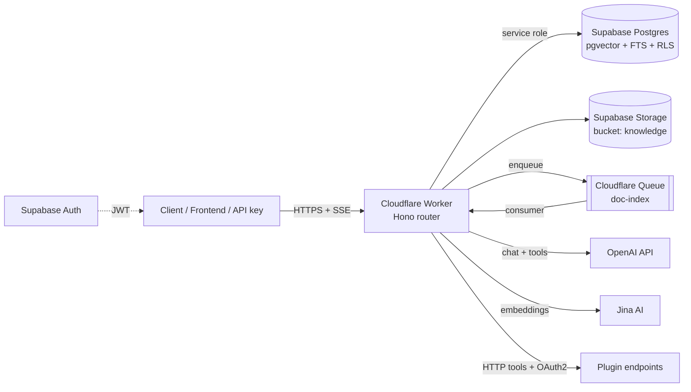

# Coze Studio — Supabase + Cloudflare Workers Port

Bản port tinh gọn của Coze Studio, chạy **hoàn toàn** trên Supabase + Cloudflare
Workers — không MySQL, không Redis, không Elasticsearch, không Milvus, không
MinIO, không NSQ, không etcd, không backend Go. Multi-tenant theo workspace,
serverless toàn phần, chi phí vận hành gần bằng 0 khi idle.

## Ánh xạ tech stack

| Coze Studio gốc | Bản port | Ghi chú |
|---|---|---|
| Go + Hertz (backend) | **Cloudflare Worker** (Hono + TypeScript) | 1 Worker duy nhất, edge-deployed |
| MySQL 8 | **Supabase Postgres** | schema + migration trong `supabase/migrations/` |
| Milvus (vector DB) | **pgvector** (HNSW, cosine) | cột `chunks.embedding vector(1024)` |
| Elasticsearch | **Postgres FTS** (`tsvector` + GIN) | hybrid search RRF trong RPC `match_chunks` |
| MinIO | **Supabase Storage** (bucket `knowledge`) | key theo prefix `workspace_id/` |
| NSQ (message queue) | **Cloudflare Queues** | fallback `ctx.waitUntil()` cho free plan |
| Python parser sidecar (PDF/DOCX) | **Parse tại edge**: `unpdf` (PDF), `fflate` (DOCX/XLSX) | không cần sidecar |
| OCR sidecar (ppocr/veocr) | **OpenAI vision** | ảnh png/jpg/webp/gif OCR khi index |
| Frontend IDE (259 packages) | **Admin console 1 file** tại `/` + trang chat public `/share/:token` | JSON editor thay drag-drop |
| Redis | *(bỏ)* | Worker stateless; Postgres đủ nhanh cho quy mô này |
| etcd | *(bỏ)* | config qua `wrangler.toml` + secrets |
| Casbin / session | **Supabase Auth + RLS** | JWT verify tại edge, RLS chặn cross-tenant |
| Embedding tự host | **Jina AI** (`jina-embeddings-v3`, 1024 dim) | task-aware: `retrieval.passage` / `retrieval.query` |
| Multi-provider LLM | **OpenAI** (hoặc bất kỳ endpoint OpenAI-compatible) | `OPENAI_BASE_URL` tùy chỉnh được |

## Kiến trúc



### Multi-tenant

- Tenant = **workspace**. Mọi bảng nghiệp vụ đều có `workspace_id`.
- Người dùng đăng nhập qua **Supabase Auth**; Worker verify JWT (HS256, local,
  không round-trip) rồi check membership ở middleware `requireWorkspace`.
- **RLS bật trên tất cả các bảng** — kể cả khi client gọi thẳng PostgREST/
  Realtime cũng không đọc được dữ liệu tenant khác.
- Truy cập máy-với-máy qua **API key** (`czk_...`, hash SHA-256, scope theo
  workspace, thu hồi được). API-key caller truyền `user_key` để định danh
  end-user (scope memory + OAuth theo từng người dùng cuối).
- Token usage ghi vào `usage_events` theo tenant → billing/quota.

### RAG pipeline (knowledge)

1. Upload tài liệu — **PDF, DOCX, XLSX, ảnh (OCR qua OpenAI vision)**,
   txt/md/html/json/csv — vào Supabase Storage (text hoặc `content_base64`).
2. Parse theo định dạng → chunk theo **strategy per dataset** (auto
   paragraph / custom separators / **heading hierarchical** với title-path,
   trim URL+email) → **Jina embeddings** → insert `chunks` (pgvector).
3. Truy vấn: query rewrite đa lượt (tùy chọn) → RPC `match_chunks` với
   **search_type** semantic/fulltext/hybrid (RRF), **min_score** threshold,
   chỉ lấy chunk `enabled` — thay Milvus + Elasticsearch bằng 1 câu SQL.
4. **Quản lý chunk (slice)**: xem theo document, thêm thủ công (embed ngay),
   sửa nội dung (re-embed), enable/disable, xóa.

### Agent runtime

- **Multimodal**: chat nhận ảnh (url/base64) qua `attachments`, đẩy vào
  vision model dạng content parts.
- Model params đầy đủ: `temperature`, `max_tokens`, `top_p`,
  `frequency/presence_penalty`, `response_format` (json mode),
  `history_rounds` (cửa sổ hội thoại cấu hình được).
- **Recall config per agent** (`agent.knowledge`): `top_k`, `min_score`,
  `search_type`, `auto` (false → recall thành tool `search_knowledge`
  on-demand), query rewrite đa lượt trước khi retrieve.
- System prompt hỗ trợ `{{var.x}}` = biến tĩnh + long-term user variables.
- Tool hợp nhất 3 loại: HTTP plugins (OAuth2 per-user), databases
  (`query/insert/update/delete_*` theo rw_mode), workflows-as-tools.
- **Auto follow-up suggestions** (mode auto/custom) qua SSE event; **LLM
  onboarding** (`GET /agents/:id/onboarding`); client abort giữa stream →
  phần trả lời dở được lưu là broken message.
- **Shortcut commands có runtime**: `/cmd a | b` map positional vào
  components, expand template, tùy chọn chạy workflow gắn kèm (kết quả
  inject làm context).
- **Multi-agent mode**: `agent.multi_agent` {enabled, sub_agents} — LLM
  router chọn sub-agent phù hợp mỗi lượt (prompt/model/tools/knowledge của
  sub-agent, hội thoại vẫn thuộc host; SSE event `route`).
- **Rerank model**: `knowledge.rerank = true` over-fetch RRF rồi xếp lại
  bằng **Jina reranker** (fallback êm khi lỗi).
- Mọi message, tool log, usage đều persist vào Postgres.

### Workflow engine v3 — parallel DAG, interactive, versioned

Graph JSON `{nodes, edges}`, thực thi **DAG song song theo wave**: node hết
phụ thuộc chạy đồng thời; nhánh không được chọn bị prune lan truyền. Template
`{{nodeId.field}}` tham chiếu kết quả node trước (giữ nguyên kiểu dữ liệu khi
đứng một mình).

**Chế độ chạy**: sync · **SSE streaming** (event `node_start`/`node_finish`/
`message`) · **async background** (202 + poll `GET /runs/:id`). **Publish
version** (`workflow_releases`) và run ghim theo version. **Interrupt–resume**:
node `question`/`input` treo run (status `suspended`, state persist), resume
qua `POST /runs/:id/resume` — kết quả node đã chạy được seed lại, không chạy
lại. **Error policy per-node** (`on_error`): retry, timeout_ms, strategy
`throw`/`default`/`branch` (edge label `error`).

**37 node types**:

| Nhóm | Node |
|---|---|
| Luồng | `start`, `end`, `condition`, `selector`, `loop` (+`break_if`), `batch` (concurrency), `sub_workflow` |
| Tương tác | `question` (hỏi user, choices), `input` (nhận input giữa run), `output_emitter` (message trung gian streaming) |
| AI | `llm`, `intent` (tự branch theo edge label) |
| Knowledge | `knowledge_retrieve` (search_type/min_score), `knowledge_index`, `knowledge_delete` |
| Database | `database_query/insert/update/delete` (tôn trọng rw_mode + per-user scope) |
| Hội thoại | `conversation_create/update/delete/list/clear`, `message_create/edit/delete/list` |
| Memory | `variable_assign` (ghi user variables) |
| Tích hợp | `plugin` (OAuth2), `http` (timeout) |
| Dữ liệu | `template`, `code` (AST interpreter an toàn, ~30 hàm), `text_processor`, `json_parse`, `json_stringify`, `variable_aggregator` |

Giới hạn an toàn: 500 node/run, 100 waves, sub-workflow depth 3, loop/batch ≤ 100 items.

### Memory domain

- **Agent databases**: bảng dữ liệu do user khai báo cột (`text/number/boolean/
  date`, required), rows JSONB validate + coerce kiểu ở Worker. Agent
  query/insert qua tool; workflow thao tác qua 4 node database.
- **Import bảng** (table-mode knowledge): upload XLSX/CSV/TSV → header thành
  cột (tự suy kiểu number/text) → rows import theo batch (tối đa 5000).
- **User variables**: biến dài hạn theo `(workspace, agent?, user_key, name)`,
  inject vào system prompt mỗi lượt chat.

### Publish agent (connector domain)

`POST /agents/:id/share` sinh share token → trang chat công khai
`/share/<token>` (không cần đăng nhập, SSE streaming, welcome + suggested
questions). End-user được scope bằng session id (`share:<session>`) cho
memory/OAuth. Thu hồi bằng `DELETE /agents/:id/share`. *(Chưa có rate limit
per-IP — cân nhắc Cloudflare WAF rule khi chạy production.)*

### Admin console

Worker serve SPA 1 file tại `/`: đăng nhập (paste token hoặc email/password
qua Supabase Auth), quản lý agents (edit/publish/share/chat thử), knowledge
(upload + xem trạng thái index + test hybrid search), workflows (JSON editor +
run + xem kết quả), plugins (+OAuth connect, invoke thử), databases (+import
xlsx/csv, xem/sửa rows), prompts, API keys, usage, search. Các trường cấu trúc
sửa qua JSON editor — không phải visual editor kéo-thả như IDE gốc.

## Cấu trúc thư mục

```
supabase-port/
├── supabase/
│   ├── config.toml                # local dev (supabase start)
│   └── migrations/
│       ├── 0001_init.sql          # schema lõi + RLS + hybrid search RPC
│       ├── 0002_domains.sql       # memory, oauth tokens, prompts, shortcuts
│       └── 0003_share.sql         # share token (publish agent công khai)
└── worker/
    ├── wrangler.toml              # 1 Worker + 1 Queue
    ├── src/
    │   ├── index.ts               # router + queue consumer
    │   ├── indexer.ts             # pipeline embedding tài liệu
    │   ├── console.ts             # admin console SPA tại /
    │   ├── engine/workflow.ts     # DAG engine v2 (27 node types)
    │   ├── middleware/auth.ts     # JWT + API key + tenant guard
    │   ├── lib/                   # openai, jina, retrieval, plugins, oauth,
    │   │                          # database, docparse, expr, chatservice,
    │   │                          # agenttools, agentloop
    │   └── routes/                # REST + SSE chat + oauth + share public
    └── test/smoke.mts             # npm test: engine, expr, parse, db, csv
```

## Triển khai

### 1. Supabase

```bash
cd supabase-port/supabase
supabase link --project-ref <ref>
supabase db push          # chạy cả 2 migrations
```

Lấy: `SUPABASE_URL`, `service_role key`, `JWT secret` (Settings → API).

### 2. Cloudflare Worker

```bash
cd supabase-port/worker
npm install
npm test                                  # smoke tests engine/parse/db
wrangler queues create doc-index          # bỏ qua nếu free plan
                                          # (xóa block queues trong wrangler.toml)
wrangler secret put SUPABASE_URL
wrangler secret put SUPABASE_SERVICE_ROLE_KEY
wrangler secret put SUPABASE_JWT_SECRET
wrangler secret put OPENAI_API_KEY
wrangler secret put JINA_API_KEY
npm run deploy
```

### 3. Dùng thử

```bash
TOKEN=<supabase-access-token>
API=https://coze-supabase-port.<account>.workers.dev

curl -X POST $API/v1/workspaces -H "authorization: Bearer $TOKEN" \
  -H 'content-type: application/json' -d '{"name": "My Team"}'

curl -X POST $API/v1/workspaces/$WID/agents -H "authorization: Bearer $TOKEN" \
  -H 'content-type: application/json' \
  -d '{"name": "Assistant", "prompt": "You are a helpful assistant.", "model": {"model": "gpt-4o-mini"}}'

curl -N -X POST $API/v1/workspaces/$WID/chat -H "authorization: Bearer $TOKEN" \
  -H 'content-type: application/json' \
  -d '{"agent_id": "'$AGENT'", "message": "Xin chào!"}'
```

Hoặc mở `https://<worker-url>/` — playground chat có sẵn.

## API chính

| Method | Path | Mô tả |
|---|---|---|
| GET | `/v1/me` | user + danh sách workspace |
| GET/POST | `/v1/workspaces` | list / tạo workspace |
| GET/PATCH/DELETE | `/v1/workspaces/:wid` | chi tiết tenant |
| GET/POST/DELETE | `.../members[/:uid]` | thành viên |
| GET | `.../usage` | token usage 30 ngày (chat/embedding/workflow) |
| CRUD | `.../agents[/:id]` + `/:id/publish`, `/:id/releases` | agent (kèm shortcuts, database_ids, workflow_ids) |
| POST | `.../chat` | **chat SSE** (RAG + plugin/db/workflow tools + memory) |
| GET/DELETE | `.../conversations[/:id]` + POST `/:id/clear` | hội thoại |
| CRUD | `.../datasets[/:dsid]` + documents, reindex, search | knowledge (PDF/DOCX/XLSX/text) |
| CRUD | `.../workflows[/:id]` + `/:id/run`, `/:id/runs` | workflow DAG |
| CRUD | `.../plugins[/:pid]/tools[/:tid]` + `invoke` | HTTP tools (debug gate) |
| POST | `.../plugins/import` | import OpenAPI/Swagger/curl/Postman |
| POST/GET | `.../plugins/:pid/publish`, `/releases` | plugin versioning |
| POST/GET | `.../workflows/:id/publish`, `/releases`, `/runs/:rid`, `/runs/:rid/resume` | workflow lifecycle + resume |
| CRUD | `.../apps[/:id]` + `/:id/publish`, `/releases[/:v]` | app packaging |
| POST | `.../files` + `/sign`, `/delete` | file service (signed URL 7d) |
| GET | `.../agents/:id/onboarding` | opening dialog (manual/LLM) |
| GET/POST | `.../datasets/:dsid/documents/:docid/chunks`, `.../chunks/:cid` | quản lý chunk |
| POST/GET | `/v3/chat`, `/v3/chat/message/list`, `/v1/conversation/create`, `/v1/conversations` | **Coze SDK compat shim** |
| POST | `.../plugins/mcp` + `/:pid/mcp/sync` | **kết nối MCP server** (tools/list, tools/call) |
| GET/POST | `.../templates` + `/:tid/install` | starter templates cài 1 click |
| GET/DELETE | `.../plugins/:pid/oauth/url`, `/status`, `/` | OAuth2 per-user |
| GET | `/oauth/callback` | public redirect (state ký HS256) |
| CRUD | `.../databases[/:dbid]` + rows, `rows/query` | memory: bảng dữ liệu |
| POST | `.../databases/import` | import XLSX/CSV/TSV thành database |
| POST/DELETE | `.../agents/:id/share` | publish / thu hồi share link |
| GET/POST | `/share/:token[/info\|/chat]` | public: trang chat + SSE (không auth) |
| GET/PUT/DELETE | `.../variables[/:id]` | memory: user variables |
| CRUD | `.../prompts[/:id]` | thư viện prompt |
| GET | `.../search?q=` | tìm resource toàn workspace |
| GET/POST/DELETE | `.../api-keys[/:id]` | API key `czk_` |

## Phạm vi so với bản gốc

> **Audit chi tiết feature-by-feature với bản gốc (mức parity thực ~35–40%,
> danh sách sót ưu tiên P0/P1/P2): xem [AUDIT.md](./AUDIT.md).**

**Đã port** (backend ~246 routes gốc → ~80 endpoints tinh gọn): multi-tenant
workspaces, agents (prompt/model/publish/shortcuts/**share công khai**), chat
streaming + 3 loại tool, knowledge RAG (PDF/DOCX/XLSX/**ảnh OCR**/text, hybrid
search), workflow DAG engine **27/42 node types** (kèm `code` node biểu thức
an toàn), HTTP plugins + OAuth2, memory (databases + **import bảng** + user
variables), prompt library, resource search, API keys, usage metering,
auth + RLS, **admin console** + trang chat public.

**Vượt bản gốc**: MCP plugin có runtime thật (gốc chỉ stub), RBAC + RLS
multi-tenant (gốc creator-only), JWKS-aware auth, hybrid search 1 câu SQL,
parse/OCR tại edge không cần sidecar.

**Chưa port** (còn lại chủ yếu P2):

- Visual editor kéo-thả cho workflow/agent (console dùng JSON editor; graph
  format tương thích nếu sau này muốn gắn React Flow)
- `code` node là expression subset chứ không phải JS tùy ý (muốn full JS
  cần QuickJS WASM)
- Marketplace cộng đồng đầy đủ (đã có 3 starter templates built-in),
  18 product plugins Trung Quốc của gốc, datacopy; connector kênh
  Slack/Telegram (đã có web share + Coze API compat)
- ppstructure accurate parsing (trích bảng/ảnh từ PDF)
- Rate limit share là per-isolate best-effort (thêm Cloudflare WAF cho
  production); plugin secret plaintext trong Postgres (có RLS) — cân nhắc
  Supabase Vault

## Dev local

```bash
supabase start                                 # Postgres + Auth + Storage local
cd worker && cp .dev.vars.example .dev.vars    # điền keys
npm install && npm test && npm run dev         # http://localhost:8787
```
