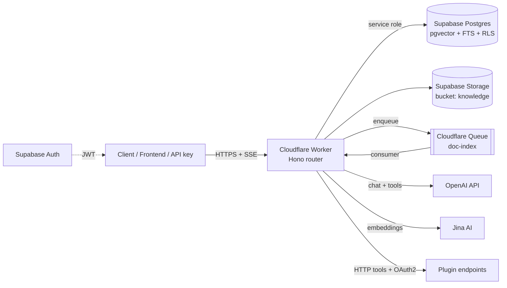

# Coze Studio — Supabase + Cloudflare Workers Port

Bản port tinh gọn của Coze Studio, chạy **hoàn toàn** trên Supabase + Cloudflare
Workers — không MySQL, không Redis, không Elasticsearch, không Milvus, không
MinIO, không NSQ, không etcd, không backend Go. Multi-tenant theo workspace,
serverless toàn phần, chi phí vận hành gần bằng 0 khi idle.

## Ánh xạ tech stack

| Coze Studio gốc | Bản port | Ghi chú |
|---|---|---|
| Go + Hertz (backend) | **Cloudflare Worker** (Hono + TypeScript) | 1 Worker duy nhất, edge-deployed |
| MySQL 8 | **Supabase Postgres** | schema + migration trong `supabase/migrations/` |
| Milvus (vector DB) | **pgvector** (HNSW, cosine) | cột `chunks.embedding vector(1024)` |
| Elasticsearch | **Postgres FTS** (`tsvector` + GIN) | hybrid search RRF trong RPC `match_chunks` |
| MinIO | **Supabase Storage** (bucket `knowledge`) | key theo prefix `workspace_id/` |
| NSQ (message queue) | **Cloudflare Queues** | fallback `ctx.waitUntil()` cho free plan |
| Python parser sidecar (PDF/DOCX) | **Parse tại edge**: `unpdf` (PDF), `fflate` (DOCX/XLSX) | không cần sidecar |
| Redis | *(bỏ)* | Worker stateless; Postgres đủ nhanh cho quy mô này |
| etcd | *(bỏ)* | config qua `wrangler.toml` + secrets |
| Casbin / session | **Supabase Auth + RLS** | JWT verify tại edge, RLS chặn cross-tenant |
| Embedding tự host | **Jina AI** (`jina-embeddings-v3`, 1024 dim) | task-aware: `retrieval.passage` / `retrieval.query` |
| Multi-provider LLM | **OpenAI** (hoặc bất kỳ endpoint OpenAI-compatible) | `OPENAI_BASE_URL` tùy chỉnh được |

## Kiến trúc



### Multi-tenant

- Tenant = **workspace**. Mọi bảng nghiệp vụ đều có `workspace_id`.
- Người dùng đăng nhập qua **Supabase Auth**; Worker verify JWT (HS256, local,
  không round-trip) rồi check membership ở middleware `requireWorkspace`.
- **RLS bật trên tất cả các bảng** — kể cả khi client gọi thẳng PostgREST/
  Realtime cũng không đọc được dữ liệu tenant khác.
- Truy cập máy-với-máy qua **API key** (`czk_...`, hash SHA-256, scope theo
  workspace, thu hồi được). API-key caller truyền `user_key` để định danh
  end-user (scope memory + OAuth theo từng người dùng cuối).
- Token usage ghi vào `usage_events` theo tenant → billing/quota.

### RAG pipeline (knowledge)

1. Upload tài liệu — **PDF, DOCX, XLSX**, txt/md/html/json/csv — vào Supabase
   Storage (text hoặc `content_base64`).
2. Queue consumer (hoặc `waitUntil` trên free plan): parse theo định dạng →
   chunk (paragraph-aware, overlap) → **Jina embeddings** (batch 32) → insert
   `chunks` (pgvector).
3. Truy vấn: embed câu hỏi (`retrieval.query`) → RPC `match_chunks` chạy
   **hybrid search** (HNSW cosine + FTS keyword, trộn Reciprocal Rank Fusion)
   ngay trong Postgres — thay cả Milvus lẫn Elasticsearch bằng 1 câu SQL.

### Agent runtime

- System prompt hỗ trợ biến `{{var.x}}` = biến tĩnh của agent **+ long-term
  user variables** (memory domain) load theo `user_key`.
- Context RAG + lịch sử hội thoại + **OpenAI streaming** (SSE) với vòng lặp
  tool-calling (tối đa 5 vòng).
- Tool của agent gồm 3 loại, hợp nhất một interface:
  1. **HTTP plugin tools** — auth `none` / `api_key` / **OAuth2 per-user**
     (authorization-code + refresh token tự động);
  2. **Agent databases** — mỗi database sinh tool `query_*` / `insert_*` với
     JSON-schema từ cột đã khai báo;
  3. **Workflows** — mỗi workflow gắn vào agent thành một function
     (tham số lấy từ `inputs` của node start).
- Mọi message, tool log, usage đều persist vào Postgres.

### Workflow engine v2 — parallel DAG

Graph JSON `{nodes, edges}`, thực thi **DAG song song theo wave**: node hết
phụ thuộc chạy đồng thời; nhánh không được chọn bị prune lan truyền. Template
`{{nodeId.field}}` tham chiếu kết quả node trước (giữ nguyên kiểu dữ liệu khi
đứng một mình). Mỗi run ghi `workflow_runs` đầy đủ input/output/node_results
(kể cả khi fail), LLM usage cộng dồn vào `usage_events`.

**23 node types**:

| Nhóm | Node |
|---|---|
| Luồng | `start`, `end`, `condition`, `selector` (multi-branch), `loop` (sub-workflow/item, tuần tự), `batch` (song song, concurrency), `sub_workflow` |
| AI | `llm`, `intent` (phân loại intent, tự branch theo edge label) |
| Knowledge | `knowledge_retrieve`, `knowledge_index` (ghi text vào dataset), `knowledge_delete` |
| Database | `database_query`, `database_insert`, `database_update`, `database_delete` |
| Tích hợp | `plugin` (kèm OAuth2), `http` (request tự do, timeout) |
| Dữ liệu | `template`, `text_processor` (concat/split/replace/substring/case/trim), `json_parse`, `json_stringify`, `variable_aggregator` |

Giới hạn an toàn: 500 node/run, 100 waves, sub-workflow depth 3, loop/batch ≤ 100 items.

### Memory domain

- **Agent databases**: bảng dữ liệu do user khai báo cột (`text/number/boolean/
  date`, required), rows JSONB validate + coerce kiểu ở Worker. Agent
  query/insert qua tool; workflow thao tác qua 4 node database.
- **User variables**: biến dài hạn theo `(workspace, agent?, user_key, name)`,
  inject vào system prompt mỗi lượt chat.

## Cấu trúc thư mục

```
supabase-port/
├── supabase/
│   ├── config.toml                # local dev (supabase start)
│   └── migrations/
│       ├── 0001_init.sql          # schema lõi + RLS + hybrid search RPC
│       └── 0002_domains.sql       # memory, oauth tokens, prompts, shortcuts
└── worker/
    ├── wrangler.toml              # 1 Worker + 1 Queue
    ├── src/
    │   ├── index.ts               # router + queue consumer
    │   ├── indexer.ts             # pipeline embedding tài liệu
    │   ├── engine/workflow.ts     # DAG engine v2 (23 node types)
    │   ├── middleware/auth.ts     # JWT + API key + tenant guard
    │   ├── lib/                   # openai, jina, retrieval, plugins, oauth,
    │   │                          # database, docparse, agenttools, agentloop
    │   ├── routes/                # REST + SSE chat + oauth callback
    │   └── playground.ts          # UI chat test tại /
    └── test/smoke.mts             # npm test: engine, parse, db, templating
```

## Triển khai

### 1. Supabase

```bash
cd supabase-port/supabase
supabase link --project-ref <ref>
supabase db push          # chạy cả 2 migrations
```

Lấy: `SUPABASE_URL`, `service_role key`, `JWT secret` (Settings → API).

### 2. Cloudflare Worker

```bash
cd supabase-port/worker
npm install
npm test                                  # smoke tests engine/parse/db
wrangler queues create doc-index          # bỏ qua nếu free plan
                                          # (xóa block queues trong wrangler.toml)
wrangler secret put SUPABASE_URL
wrangler secret put SUPABASE_SERVICE_ROLE_KEY
wrangler secret put SUPABASE_JWT_SECRET
wrangler secret put OPENAI_API_KEY
wrangler secret put JINA_API_KEY
npm run deploy
```

### 3. Dùng thử

```bash
TOKEN=<supabase-access-token>
API=https://coze-supabase-port.<account>.workers.dev

curl -X POST $API/v1/workspaces -H "authorization: Bearer $TOKEN" \
  -H 'content-type: application/json' -d '{"name": "My Team"}'

curl -X POST $API/v1/workspaces/$WID/agents -H "authorization: Bearer $TOKEN" \
  -H 'content-type: application/json' \
  -d '{"name": "Assistant", "prompt": "You are a helpful assistant.", "model": {"model": "gpt-4o-mini"}}'

curl -N -X POST $API/v1/workspaces/$WID/chat -H "authorization: Bearer $TOKEN" \
  -H 'content-type: application/json' \
  -d '{"agent_id": "'$AGENT'", "message": "Xin chào!"}'
```

Hoặc mở `https://<worker-url>/` — playground chat có sẵn.

## API chính

| Method | Path | Mô tả |
|---|---|---|
| GET | `/v1/me` | user + danh sách workspace |
| GET/POST | `/v1/workspaces` | list / tạo workspace |
| GET/PATCH/DELETE | `/v1/workspaces/:wid` | chi tiết tenant |
| GET/POST/DELETE | `.../members[/:uid]` | thành viên |
| GET | `.../usage` | token usage 30 ngày (chat/embedding/workflow) |
| CRUD | `.../agents[/:id]` + `/:id/publish`, `/:id/releases` | agent (kèm shortcuts, database_ids, workflow_ids) |
| POST | `.../chat` | **chat SSE** (RAG + plugin/db/workflow tools + memory) |
| GET/DELETE | `.../conversations[/:id]` + POST `/:id/clear` | hội thoại |
| CRUD | `.../datasets[/:dsid]` + documents, reindex, search | knowledge (PDF/DOCX/XLSX/text) |
| CRUD | `.../workflows[/:id]` + `/:id/run`, `/:id/runs` | workflow DAG |
| CRUD | `.../plugins[/:pid]/tools[/:tid]` + `invoke` | HTTP tools |
| GET/DELETE | `.../plugins/:pid/oauth/url`, `/status`, `/` | OAuth2 per-user |
| GET | `/oauth/callback` | public redirect (state ký HS256) |
| CRUD | `.../databases[/:dbid]` + rows, `rows/query` | memory: bảng dữ liệu |
| GET/PUT/DELETE | `.../variables[/:id]` | memory: user variables |
| CRUD | `.../prompts[/:id]` | thư viện prompt |
| GET | `.../search?q=` | tìm resource toàn workspace |
| GET/POST/DELETE | `.../api-keys[/:id]` | API key `czk_` |

## Phạm vi so với bản gốc

**Đã port** (backend ~246 routes gốc → ~70 endpoints tinh gọn): multi-tenant
workspaces, agents (prompt/model/publish/shortcuts), chat streaming + 3 loại
tool, knowledge RAG (PDF/DOCX/XLSX/text, hybrid search), workflow DAG engine
23/42 node types, HTTP plugins + OAuth2, memory (databases + user variables),
prompt library, resource search, API keys, usage metering, auth + RLS.

**Chưa port** (chủ đích, ngoài phạm vi lean):

- Frontend IDE React 259-package (visual editors, debug panel) — playground
  chat thay thế; frontend cũ có thể trỏ dần sang API mới
- Workflow: `code_runner` (Workers cấm eval; cần QuickJS WASM nếu muốn),
  `question_answer` tương tác giữa run, message/conversation nodes trong
  workflow
- Knowledge: OCR ảnh (gốc dùng ppocr/veocr), table-mode xlsx thành structured
  knowledge (xlsx hiện parse thành text)
- App packaging (đóng gói multi-agent app), connector publish ra kênh ngoài,
  template marketplace, datacopy
- Plugin secret hiện lưu plaintext trong Postgres (có RLS); nâng cấp Supabase
  Vault nếu cần mã hóa at-rest

## Dev local

```bash
supabase start                                 # Postgres + Auth + Storage local
cd worker && cp .dev.vars.example .dev.vars    # điền keys
npm install && npm test && npm run dev         # http://localhost:8787
```
